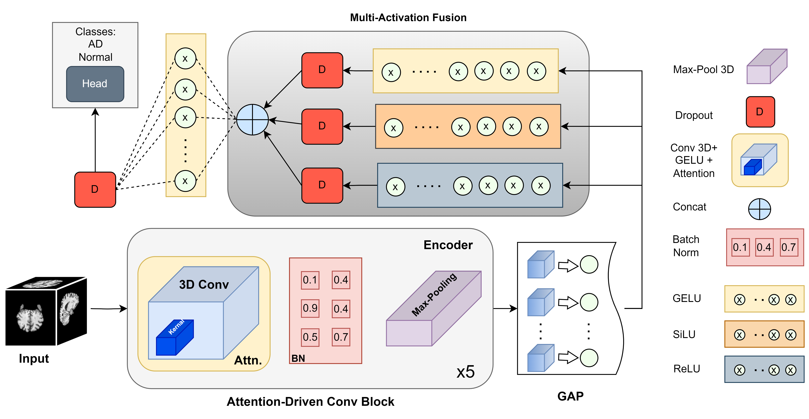

# ANovelDeepLearning Approach for Alzheimer’s Disease Detection: Attention-Driven CNNs with Multi-Activation Fusion

## Abstract
Alzheimer's disease (AD) ranks high among the top causes of death worldwide, yet its diagnosis using traditional approaches often suffers from challenges such as reliance on subjective diagnosis by doctors or manual feature extraction in automation approaches. In automation, issues related to susceptibility to data imbalance and the inability to generalise across diverse populations were encountered. To address these limitations, the latest developments in artificial intelligence (AI) have introduced novel methods to classify neuroimaging data, particularly leveraging convolutional neural network (CNN) architectures and vision transformers in the domain of deep learning. Although these methodologies have significantly improved the diagnostic accuracy for AD, ongoing issues such as the requirement for large, well-annotated datasets and costly computing resources still exist. This study leverages a comprehensive dataset from the Alzheimer's Disease Neuroimaging Initiative (ADNI) and introduces an innovative model architecture that integrates attention-driven convolutional and multi-activation fusion (MAF) strategies. The attention-driven block specifically focuses on essential features, whereas the MAF approach enables the model to capture diverse key feature representations, enhancing classification performance. The experimental results showed significant improvements, with the model achieving 92.1\% accuracy, 99\% Area Under the Curve (AUC), along with precision, recall, and F1-score values of 91.3\%, 89.3\%, and 92\%, respectively. Additionally, 10-fold cross-validation demonstrated an average accuracy of 91.23\%, the AUC is 92.75\%, the precision is 90.29\%, and the recall is 88.30\%. Furthermore, the proposed model outperforms several recent deep learning (DL) models in AD classification, demonstrating its superior efficacy and optimisation. These outcomes emphasise the need for superior deep learning methods in the early diagnosis of AD.

## Model Architecture


## Methodology


## Important Preprocessing

### HD-BET
This approach is utilized for skull stripping from the images. Preprocess data using the [HD-BET](https://github.com/MIC-DKFZ/HD-BET) method and prepare the data as instructed below.

## Datset Prepration:
Your dataset should be structure in a DataFrame.
```
| ADNI_path | Group |
|-----------|-------|
| ./train/CN/20070215202408595_S13839_I40312.nii.gz | CN |
| ./train/20070215200838637_S22267_I40303.nii.gz | CN |
| ./train/20081008133944436_S13839_I119726.nii.gz | CN |
| ./train/20080410151355187_S47536_I102146.nii.gz | AD |
| ./train20080220165919265_S18766_I91253.nii.gz | AD |
```
## Requirements
- Python 3.9.19
- ```sh
conda create MAF python=3.9.19
```

## Installation
1. Clone the repository:
    ```sh
    git clone https://github.com/MAlsubaie/Attention-Driven-CNNs-for-AD-Detection-via-MAF.git
    ```
2. Navigate to the project directory:
    ```sh
    cd Attention-Driven-CNNs-for-AD-Detection-via-MAF
    ```
3. Install the required packages:
    ```sh
    pip install -r requirements.txt
    ```

## Usage

### Training
To train the model, run the following command:
```sh
python train.py
```

### Evaluation
To evaluate the model, run the following command:
```sh
python evaluate.py
```

### GradCAM Results
<p align="center">
    
    
</p>


## License
This project is licensed under the MIT License - see the [LICENSE](LICENSE) file for details.
